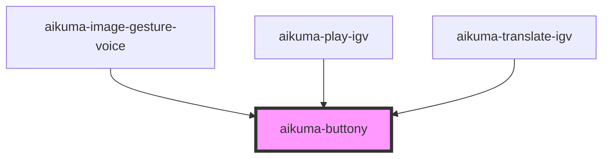

# aikuma-buttony

<!-- Auto Generated Below -->

## Properties

| Property   | Attribute  | Description | Type      | Default |
| ---------- | ---------- | ----------- | --------- | ------- |
| `clear`    | `clear`    |             | `boolean` | `false` |
| `disabled` | `disabled` |             | `boolean` | `false` |
| `id`       | `id`       |             | `string`  | `null`  |
| `size`     | `size`     |             | `string`  | `'50'`  |

## Events

| Event        | Description | Type                                         |
| ------------ | ----------- | -------------------------------------------- |
| `clickEvent` |             | `CustomEvent<{ id: string; type: string; }>` |

## Dependencies

### Used by

 - [aikuma-image-gesture-voice](..\image-gesture-voice)
 - [aikuma-play-igv](..\play-igv)
 - [aikuma-translate-igv](..\translate-igv)

### Graph

----------------------------------------------

*Built with [StencilJS](https://stenciljs.com/)*
