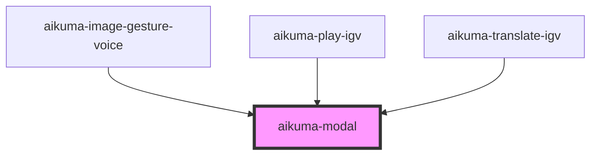

# aikuma-modal

<!-- Auto Generated Below -->

## Methods

### `presentDialog(title: string, message: string, confirm: string, cancel?: string) => Promise<boolean>`

#### Returns

Type: `Promise<boolean>`

## Dependencies

### Used by

 - [aikuma-image-gesture-voice](..\image-gesture-voice)
 - [aikuma-play-igv](..\play-igv)
 - [aikuma-translate-igv](..\translate-igv)

### Graph

----------------------------------------------

*Built with [StencilJS](https://stenciljs.com/)*
