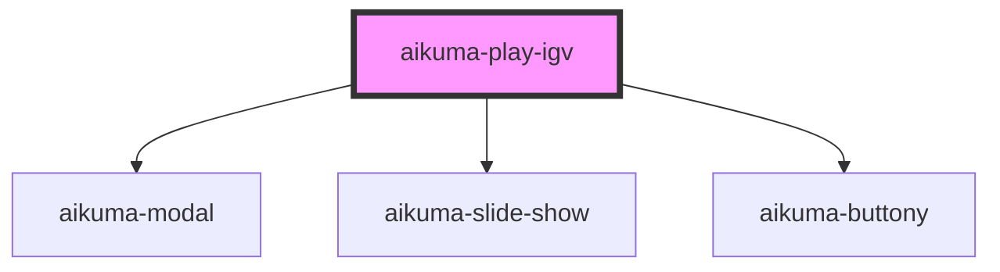

# aikuma-play-igv

<!-- Auto Generated Below -->

## Events

| Event       | Description | Type                  |
| ----------- | ----------- | --------------------- |
| `aikumaIGV` |             | `CustomEvent<string>` |

## Methods

### `restoreFromIGVBundle(igvb: IGVBundle) => Promise<void>`

#### Returns

Type: `Promise<void>`

## Dependencies

### Depends on

- [aikuma-modal](..\modal)
- [aikuma-slide-show](..\slide-show)
- [aikuma-buttony](..\buttony)

### Graph

----------------------------------------------

*Built with [StencilJS](https://stenciljs.com/)*
