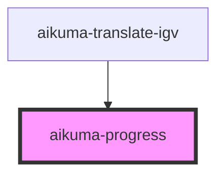

# aikuma-progress

<!-- Auto Generated Below -->

## Properties

| Property         | Attribute         | Description | Type     | Default   |
| ---------------- | ----------------- | ----------- | -------- | --------- |
| `completedColor` | `completed-color` |             | `string` | `'brown'` |
| `height`         | `height`          |             | `number` | `15`      |
| `lineWidth`      | `line-width`      |             | `number` | `1`       |
| `progressColor`  | `progress-color`  |             | `string` | `'green'` |
| `strokeColor`    | `stroke-color`    |             | `string` | `'black'` |

## Methods

### `setProgress(progress: number) => Promise<void>`

#### Returns

Type: `Promise<void>`

## Dependencies

### Used by

 - [aikuma-translate-igv](..\translate-igv)

### Graph

----------------------------------------------

*Built with [StencilJS](https://stenciljs.com/)*
