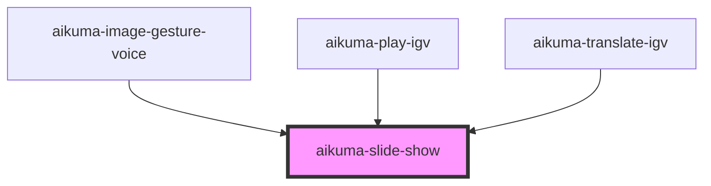

# aikuma-slide-show

<!-- Auto Generated Below -->

## Events

| Event        | Description | Type                                                 |
| ------------ | ----------- | ---------------------------------------------------- |
| `slideEvent` |             | `CustomEvent<{ type: string; val: any; }>`           |
| `slideSize`  |             | `CustomEvent<{ content: DOMRect; frame: DOMRect; }>` |

## Methods

### `getCurrent() => Promise<number>`

#### Returns

Type: `Promise<number>`

### `getCurrentImageElement() => Promise<HTMLImageElement>`

#### Returns

Type: `Promise<HTMLImageElement>`

### `getSwiperInstances() => Promise<{ main?: any; thumb?: any; }>`

#### Returns

Type: `Promise<{ main?: any; thumb?: any; }>`

### `highlightSlide(idx: number) => Promise<void>`

#### Returns

Type: `Promise<void>`

### `isChanging() => Promise<boolean>`

#### Returns

Type: `Promise<boolean>`

### `loadImages(images: string[], settings?: SlideshowSettings) => Promise<Slide[]>`

#### Returns

Type: `Promise<Slide[]>`

### `loadSlides(slides: Slide[]) => Promise<void>`

#### Returns

Type: `Promise<void>`

### `lockPrevious() => Promise<void>`

#### Returns

Type: `Promise<void>`

### `slideTo(idx: number, instant?: boolean) => Promise<void>`

#### Returns

Type: `Promise<void>`

### `unlockPrevious() => Promise<void>`

#### Returns

Type: `Promise<void>`

## Dependencies

### Used by

 - [aikuma-image-gesture-voice](..\image-gesture-voice)
 - [aikuma-play-igv](..\play-igv)
 - [aikuma-translate-igv](..\translate-igv)

### Graph

----------------------------------------------

*Built with [StencilJS](https://stenciljs.com/)*
