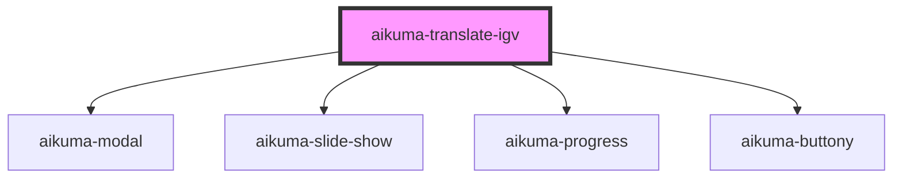

# aikuma-translate-igv

<!-- Auto Generated Below -->

## Methods

### `loadIGVData(data: IGVData, opts?: IGVOptions) => Promise<any>`

#### Returns

Type: `Promise<any>`

### `waitForComplete() => Promise<IGVTranslation>`

#### Returns

Type: `Promise<IGVTranslation>`

## Dependencies

### Depends on

- [aikuma-modal](..\modal)
- [aikuma-slide-show](..\slide-show)
- [aikuma-progress](..\progress)
- [aikuma-buttony](..\buttony)

### Graph

----------------------------------------------

*Built with [StencilJS](https://stenciljs.com/)*
